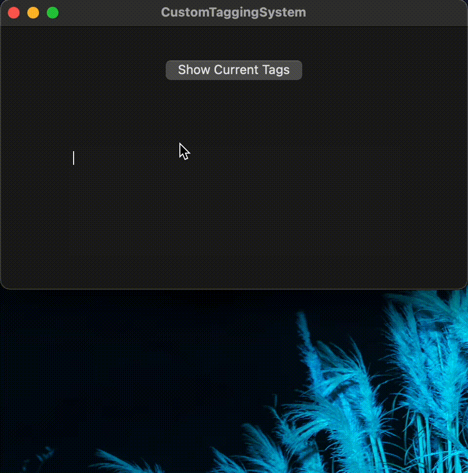

# Custom Tagging System

This project attempts to recreate the tagging system that is found in the MacOS Finder app. 

## How it Works
The tags are created using a `NSImage` that is created programatically and are sized to the reciving text views font size. Once created, the `NSImage` are placed inside a sub-class of `NSTextAttachment` (called `TagTextAttachment`), which contains the extra property `name`. The extra property `name` is added to help filter the list of possible suggestions to prevent duplicates and to help maintain a list of current tags. Once the `TagTextAttachment` is created, it is then placed inside a `NSAttributedString` for insertion to the text view (`NSTextView` in this demo's case). Any text view/field that supports `NSAttributedString` can take advantage of these custom tags.

## Features
- Custom suggestion menu
- Live replacement of suggestions
- Keyboard navigation of suggestions
- Auto-creation if a tag does not exist
- Auto-creation & auto-cancellation is focus is lost
- Saving tags to a plist file
- Restoring tags from a plist file

## Todo
- Right click menu on tags for live-editing
- Drag-and-drop rearranging for tags (maybe?)

## Contributions
Contributions to this project are allowed. However, if the contribution is major, please open an issue to discuss your intended changes.

## License
[MIT License](LICENSE)
